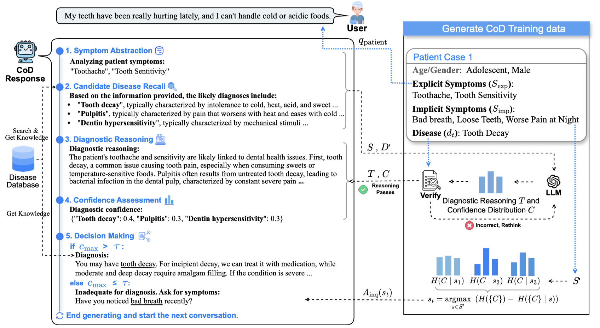

# CoD, Towards an Interpretable Medical Agent using Chain of Diagnosis

<div align="center">
<h5>
  📃 <a href="https://arxiv.org/abs/2407.13301" target="_blank">Paper</a>  • 🖥️ <a href="#" target="https://diagnosis.huatuogpt.cn/">Demo</a>
</h5>
</div>

<div align="center">
<h4>
  📚 <a href="https://huggingface.co/datasets/FreedomIntelligence/CoD-PatientSymDisease" target="_blank">CoD Data</a> • 📚 <a href="https://huggingface.co/datasets/FreedomIntelligence/Disease_Database" target="_blank">Disease Database</a> • 📝 <a href="https://huggingface.co/datasets/FreedomIntelligence/DxBench" target="_blank">DxBench(Benchmark)</a>
</h4>
</div>

<div align="center">
<h4>
  🤗 <a href="https://huggingface.co/FreedomIntelligence/DiagnosisGPT-34B" target="_blank">DiagnosisGPT-34B</a>  • 🤗 <a href="https://huggingface.co/FreedomIntelligence/DiagnosisGPT-6B">DiagnosisGPT-6B</a> 
</h4>
</div>

## ✨ Updates
- [2024/07/19]: We launched our diagnostic LLMs, [DiagnosisGPT-6B](https://huggingface.co/FreedomIntelligence/DiagnosisGPT-6B) and [DiagnosisGPT-34B](https://huggingface.co/FreedomIntelligence/DiagnosisGPT-34B), supporting automatic diagnosis for **9,604** diseases.
- [2024/07/18]: We released our data, including [CoD data](https://huggingface.co/datasets/FreedomIntelligence/CoD-PatientSymDisease), the [disease database](https://huggingface.co/datasets/FreedomIntelligence/Disease_Database), and the [DxBench](https://huggingface.co/datasets/FreedomIntelligence/DxBench) benchmark.
- [2024/07/18]: We introduced the **Chain-of-Diagnosis (CoD)** to improve the trustworthiness and interpretability of medical diagnostics.

## ⚡ Introduction
We propose the Chain-of-Diagnosis to improve interpretability in medical diagnostics for Large Language Models (LLMs). CoD features include:
1. Transforming the opaque decision-making process into a five-step diagnostic chain that reflects a physician’s thought process.
2. Producing a confidence distribution, where higher confidence suggests greater certainty in diagnosing a specific disease. CoD formalizes the diagnostic process as a process of reducing diagnostic certainty entropy.

<div align=center>

</div>


## 👩‍⚕️ Model
We developed **DiagnosisGPT**, an LLM using the CoD method for automated diagnosis of 9,604 diseases. 
|                 | Backbone           | Checkpoint                                                                            |
|----------------------|--------------------|---------------------------------------------------------------------------------------|
| **DiagnosisGPT-7B**  | Yi-6B          | [HF Link](https://huggingface.co/FreedomIntelligence/DiagnosisGPT-6B)        |
| **DiagnosisGPT-34B** | Yi-34B         | [HF Link](https://huggingface.co/FreedomIntelligence/DiagnosisGPT-34B)      |

- **Command Line Interface**

Chat via the command line:
```bash
python cod_cli.py --model_dir path-to-diagnosisgpt-vision-model
```

- **Model Inference**

Inference using our ChatBot:
```python
query = 'I have a sore throat and seem to have a fever.'

from cod_cli import DiagnosisChatbot
bot = DiagnosisChatbot(path-to-diagnosisgpt-vision-model, confidence_threshold=0.5)

output, history, confidence_distribution = bot.inference(query)
print(output) # Prints the output of the model
```

## 📚 Data


| Data             | Description                                                       | Download Link                                                                           |
| ---------------- | ----------------------------------------------------------------- | --------------------------------------------------------------------------------------- |
| CoD Data         | (1) Data of 50K synthetic patients constructed from medical encyclopedia. (2) 50K Chain-of-Diagnosis training data. | [Link](https://huggingface.co/datasets/FreedomIntelligence/CoD-PatientSymDisease)       |
| Disease Database | Database of 9,604 diseases with symptoms and treatments.       | [Link](https://huggingface.co/datasets/FreedomIntelligence/Disease_Database)            |
| DxBench          | A large-scale disease diagnosis benchmark built on real patient-doctor dialogue, covering 15 departments and 461 diseases. | [Link](https://huggingface.co/datasets/FreedomIntelligence/DxBench)                     |


## 🏋️‍♂️ Training
1. Prepare the Training Data
You can download the [CoD data](https://huggingface.co/datasets/FreedomIntelligence/CoD-PatientSymDisease) and run the following code for preprocessing:
```bash
python train/datapre.py --model_path 01-ai/Yi-34B --data_dir CoD_en.json
```

2. Training
Then, you can train the model by:
```bash
cd train
bash fine_tune.sh
```

## 🧐 Evaluation
Run the following code for evaluation.

```bash
# Evaluate DxBench 
accelerate launch eval.py --model_path path_to_the_model --data_path ./evaluation/DxBench_zh.json --max_inquiry 0 --threshold 0.5
# Evaluate Dxy Dataset
accelerate launch eval.py --model_path path_to_the_model --data_path ./evaluation/Dxy_zh.json --max_inquiry 0 --threshold 0.5
# Evaluate Muzhi Dataset
accelerate launch eval.py --model_path path_to_the_model --data_path ./evaluation/Muzhi_zh.json --max_inquiry 0 --threshold 0.5
```

## Citation

```
@misc{chen2024codinterpretablemedicalagent,
      title={CoD, Towards an Interpretable Medical Agent using Chain of Diagnosis}, 
      author={Junying Chen and Chi Gui and Anningzhe Gao and Ke Ji and Xidong Wang and Xiang Wan and Benyou Wang},
      year={2024},
      eprint={2407.13301},
      archivePrefix={arXiv},
      primaryClass={cs.CL},
      url={https://arxiv.org/abs/2407.13301}, 
}
```
